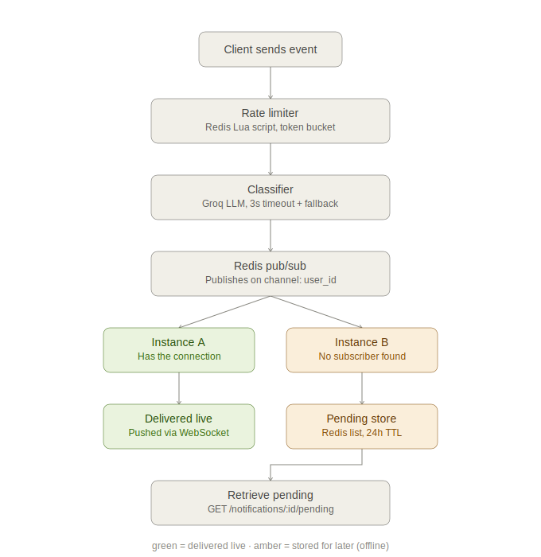

# NotifyGate

A rate-limited, LLM-classified real-time notification gateway. Built with FastAPI, Redis (Upstash), WebSockets, and Groq.

---

## Architecture



### How cross-instance delivery works

The tricky requirement here was: a user connected to Instance A needs to get an event even if that event came in through Instance B. Here's how I approached it.

Each instance keeps its own in-memory `user_id → WebSocket` dictionary (`connection_manager.py`). That map only means anything inside that one process — I made sure never to treat it as the source of truth for anything.

When a client connects and sends its `user_id`, that instance also subscribes to a Redis Pub/Sub channel for that user (`channel:{user_id}`) in a background task. So now, whenever *any* instance ingests an event for that user, it just publishes to that same channel — it doesn't need to know or care who's actually holding the connection. Redis takes care of fanning that out to whichever instance is subscribed, and that instance forwards it to its local socket.

The nice part: `PUBLISH` tells you how many subscribers actually got the message. If that number is 0, I know nobody has this user connected anywhere, so I write the event to a Redis List instead so it isn't lost.

So Redis Pub/Sub is doing the cross-instance bridging, and the Redis List is the safety net for offline users. I didn't need to change anything about this design to make it work behind a load balancer with multiple instances — it was built that way from the start.

### How the rate limiter actually works

This is a token bucket, implemented as a Redis Lua script (`app/token_bucket.lua`) so the whole check-and-decrement happens as one atomic operation on Redis's side.

Here's the logic:

1. Each `user_id` gets a Redis hash storing two things: how many tokens it currently has, and when it was last refilled.
2. On every request, the script first figures out how much time has passed since the last refill, and calculates how many new tokens should've accumulated since then (1 every 2 seconds), capped at the max of 5.
3. If there's at least 1 token available after that, it deducts one and allows the request. If not, it rejects it.
4. It writes the updated token count and refill timestamp back, and sets a 60-second expiry on the key so idle users don't leave stale data sitting in Redis forever.

The reason I did this as a Lua script instead of separate GET/SET calls from Python is concurrency. If I read the token count, calculated the new value in Python, and then wrote it back — two requests arriving at the same time could both read "3 tokens left," both think they're allowed, and both write back 2, when really only one of them should've gone through. Redis runs Lua scripts as a single atomic step, so there's no window where two requests can interleave like that. That's what makes the "exactly 5 out of 20" test actually hold up under real concurrency instead of just usually working.

---

## Setup

You'll need Python 3.10+, a free [Upstash Redis](https://upstash.com) database, and a free [Groq API key](https://console.groq.com).

```bash
git clone <your-repo-url>
cd notifygate
pip install -r requirements.txt
```

Copy `.env.example` to `.env` and drop in your own values:
```
REDIS_URL=rediss://default:<password>@<your-endpoint>.upstash.io:6379
GROQ_API_KEY=gsk_xxxxxxxxxxxxxxxxxxxxx
```

Run the server:
```bash
python -m uvicorn app.main:app --reload
```

Run the tests:
```bash
python -m pytest tests/ -v
```
This includes the concurrency test from Part 1 — it fires 20 simultaneous requests at the same `user_id` and checks that exactly 5 go through.

---

## Trying it out

For the REST endpoints, easiest way is to just go to `http://127.0.0.1:8000/docs` once the server's running — FastAPI gives you a working Swagger UI for free, so you can hit `/events`, `/health`, and `/notifications/{user_id}/pending` straight from the browser without needing curl or Postman.

WebSocket connections can't be tested from Swagger though, so I added a small script for that:
```bash
python tests/test_ws_client.py
```
Run that in one terminal to connect as a test user, then `POST /events` with the same `user_id` from another terminal — you should see the message show up instantly in the first one.

---

## Written Section

Here is a concise, structured breakdown of your engineering choices and their trade-offs. It keeps things sharp and punchy for easy scanning.

## Redis Outage (90s)
Current State: Naked Redis calls throw unhandled exceptions, turning rate-limit or storage failures into generic 500 Internal Server Error responses.

The Fix: Wrap Redis calls in try/except blocks and catch connectivity issues explicitly.

The Trade-off (Fail Closed): If Redis is down, return a clear 503 Service Unavailable and log it as redis_unavailable.

Why: It protects downstream services from an accidental DDoS. Avoiding local in-memory fallbacks prevents data inconsistency across instances.

## LLM Provider Outage (10 min)
Current State: The system relies on asyncio.wait_for(timeout=3.0) around classify_event().

The Behavior: If Groq fails or times out, the system logs classification_failed or classification_timeout and defaults the event priority to "normal".

The Trade-off (Fail Open): Events are never dropped; they flow through the entire live/pending pipeline with degraded priority classification.

Why: Delivering an urgent notification with a "normal" tag is a minor UX issue; silently dropping a critical message is a system failure.

## Missing user_id over WebSockets
Current State: Unlike the REST endpoint (where Pydantic enforces schema validation and throws a 422), the WebSocket connection reads raw JSON via receive_json(). Missing IDs would cause silent dictionary key overwrites in memory.

The Fix: Manually validate the presence of user_id immediately after the connection handshake.

The Behavior: Reject invalid clients immediately by closing the socket with a custom close code (4001) and a clear reason string.

Why: Mirrors the API’s validation logic and cleanly prevents state corruption.

## What I'd do differently with more time

- Actually handle Redis being unavailable instead of letting it 500 — as above
- Right now `GET /notifications/:user_id/pending` clears the list the moment it's read, which means if a client crashes right after getting the response but before actually processing it, that data's gone for good. I'd want some kind of ack step, or at least a short delay before deleting
- A local fallback rate limiter for short Redis outages, so it's not just all-or-nothing between fail-open and fail-closed
- I only tested the pub/sub cross-instance design manually with two terminals — I'd want to actually load test it with a bunch of concurrent connections to be more confident it holds up
- Adding a request ID that follows one event through the whole pipeline (rate limit → classify → deliver) in the logs. I actually ran into a confusing moment while building this where a stale reloaded server process made my test results look wrong — a request ID would've made that obvious in about five seconds instead of the twenty minutes it took me to figure out
